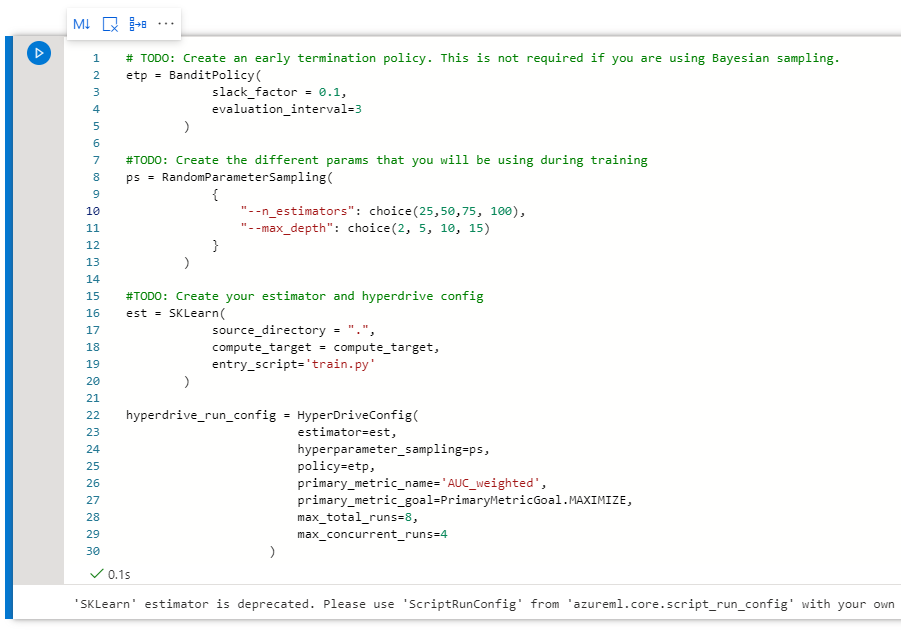
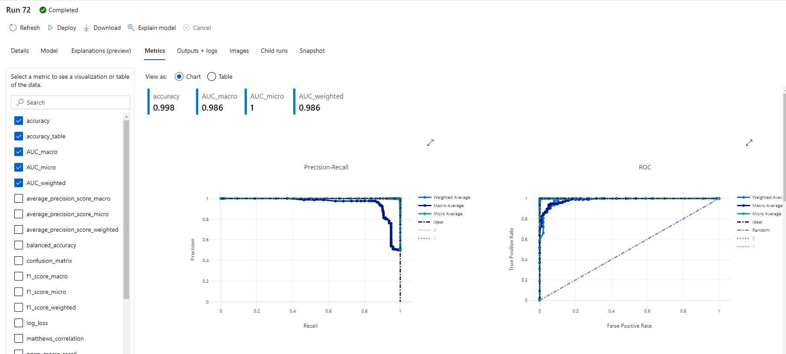

# Capstone - Azure Machine Learning Engineer

## Overview
In this project, you are creating two models: one using Automated ML (denoted as AutoML from now on) and one customized model whose hyperparameters are tuned using HyperDrive. We specified various configurations for both the ways using which we will be generating our models. Once the models are trained we are going to deploy and consume the best performing model.

## Data
We have taken the dataset from the Kaggle's credit card fraud detection datasets.
[Credit Card Fraud Detection | Kaggle](https://www.kaggle.com/mlg-ulb/creditcardfraud)
The dataset contains Anonymized credit card transactions labeled as fraudulent or genuine. We are using AutoML and Hyperdrive to train various to identify if the transaction is fraudulant or not.

#### Attribute Information:

Input variables:  
Time: Number of seconds elapsed between this transaction and the first transaction in the dataset
v1 to v28: may be result of a PCA Dimensionality reduction to protect user identities and sensitive features
Amount: Transaction amount
  
Output variable (desired target):  
Class: 1 for fraudulent transactions, 0 otherwise)

For both the experiements, we have downloaded the csv file from the abovementioned website and then created a dataset using Azure ML studio's dataset section.

## Architectural Diagram
The Architectural diagram is as follows. This covers the most crucial steps we did in the project. 

## Hyperdrive 
We are using the credit card fraud detection dataset downloaded from the Kaggle website. We downloaded the files using the Kaggle API and then uploaded them to the Azure ML studio's dataset section.

Then we created a compute instance for our notebooks to run and started the `hyperparemeter_tuning.ipynb` We imported all the necessary libraries, Created an experiement and fetched the dataset. 

Now we need to specify the Parameter sampler, Estimator and early stopping policy configurations so that we can use them in the hyperdrive configurations. These configurations are as follows.

We chose two parameters of the `RandomForestClassifier` that we are using for classification. `n_estimators` and `max_depth`. Using a randome choice and random int respectively we are training multiple models.

After training we can get the best model which has the highest accuracy. We can also see the corresponding hyperparameters

Through the following graph in the Azure's ML studio we can see how every model performed.

We will now save this model and move on the AutoML experiments

## AutoML
For this the process is similar. We wil use the exact same dataset and compute which we created before. And then specify an AutoML config. The details are explained in the image.

We will start the training of this AutoML experiement and wait for it to finish. As we can observe the AutoML trained multiple models including the RandomForestClassifier which we used in the HyperDrive experiment.

The Details fro the RunWidget are as follows

The details of the best performing models through AutoML are as follows

I also exported the model explanation so that we can see which of the features from input dataset affect the prediction the most.

The best performing model was the VotingClassifier with an Area Under the Curve of 98.7%. This is a much better model than our previous hyperdrive model because of following reasons.
1.	Due to the difference between the volume of non fraudulant and fraudulant transactions the previous model may have suffered from Accuracy Paradox.
2.	The AutoML's Area Under the Curve consideres precision and recall and then estimates the performance of the model. Which means that our model has not overfitted to a class and performed well.
3.	In the jupyter notebook we can see that the predicted values and the actual values are identical.

Hence we have deployed the AutoML model and created an endpoint.

Then we have used this endpoint to predict the new input.

## Screen Recording
Here's a link to my Screen recording: https://www.awesomescreenshot.com/video/2655417?key=420b0fb1eca610211c15105bbf4c9143

## Standout Suggestions
1. We could improve the accuracy of the model even more by including more data
2. We can perform some more preprocessing to the data like one hot encoding to make sure the data is more suitable for ML operations.
3. We can also include deep learning and allow execution of the models for a longer time to find an even more accurate model
4. We can also normalize the input data to make sure that the values are between 0 to 1. This retains the relative importance of the features.
