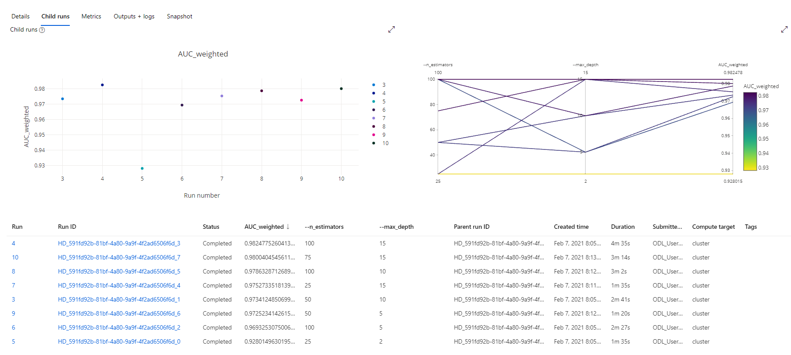
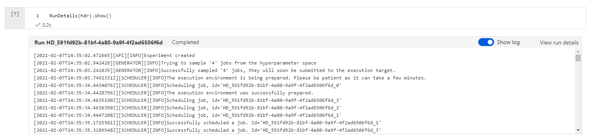
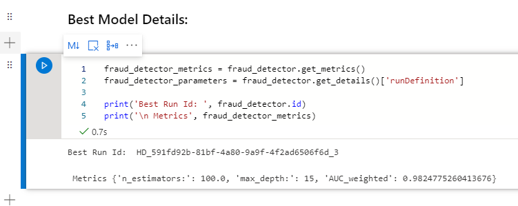
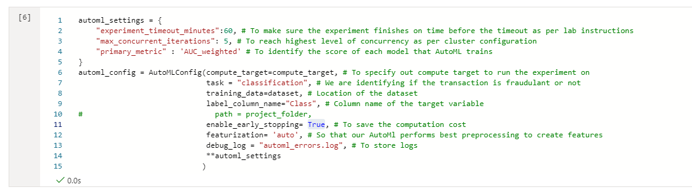
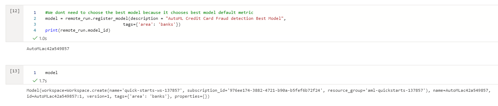
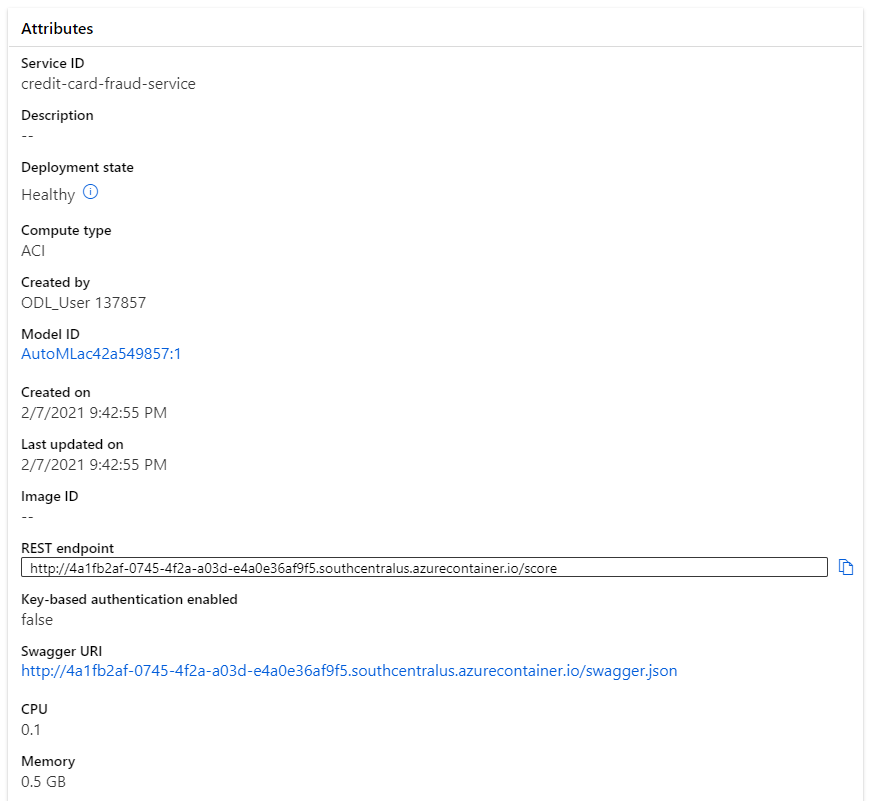
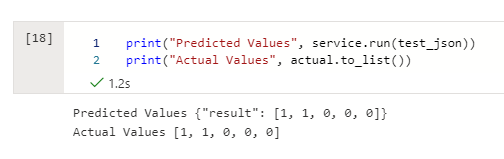

# Capstone - Azure Machine Learning Engineer

## Overview
In this project, you are creating two models: one using Automated ML and one customized model whose hyperparameters are tuned using HyperDrive. We specified AutoML Config and HyperDrive Config respectively to generate multiple models. Once the models are trained we identify the best performing model within the AutoML and Hyperdrive and then we deploy and consume the best performing model.

## Data
We have taken the dataset from the Kaggle's credit card fraud detection datasets.
[Credit Card Fraud Detection | Kaggle](https://www.kaggle.com/mlg-ulb/creditcardfraud)
The dataset contains Anonymized credit card transactions labeled as fraudulent or genuine. We are using AutoML and Hyperdrive to train various to identify if the transaction is fraudulant or not.

### Attribute Information:

Input variables:  
Time: Number of seconds elapsed between this transaction and the first transaction in the dataset
v1 to v28: may be result of a PCA Dimensionality reduction to protect user identities and sensitive features
Amount: Transaction amount
  
Output variable (desired target):  
Class: 1 for fraudulent transactions, 0 otherwise)

For both the experiements, we have downloaded the csv file from the abovementioned website and then created a dataset using Azure ML studio's dataset section.

## Architectural Diagram
The Architectural diagram is as follows. This covers the most crucial steps we did in the project. 

## Hyperdrive 
We are using the credit card fraud detection dataset downloaded from the Kaggle website. We downloaded the files using the Kaggle API and then uploaded them to the Azure ML studio's dataset section.

Then we created a compute instance for our notebooks to run and started the `hyperparemeter_tuning.ipynb` We imported all the necessary libraries, Created an experiement and fetched the dataset. 

Now we need to specify the Parameter sampler, Estimator and early stopping policy configurations so that we can use them in the hyperdrive configurations. These configurations are as follows.

<b><i>Explanation of Config used</b></i>

    # TODO: Create an early termination policy. This is not required if you are using Bayesian sampling.
    
    etp = BanditPolicy( # BanditPolicy is based on slack factor/slack amount and evaluation interval. Bandit terminates runs where the primary metric is not within the specified slack factor/slack amount compared to the best performing run. Hence when the differnce between the previous models AUC is not within the range of slack factor Then the model training is terminated automatically.
      slack_factor = 0.1,
      evaluation_interval=3
    )
   
    
    ps = RandomParameterSampling( # Random Parameter Sampler supports discrete and continuous hyperparameters. As our resources are limited and time bounded. This is the best sampler we can use for low performance impact.
      {
        "--n_estimators": choice(25, 50, 75, 100),, # Default value for this is 100, Instead of randomly searching through all values for this. I created distinct choices which can reduce the number of runs and can show impact as the values change significantly.
        "--max_depth": choice(2, 5, 10, 15) # Default value is None, which means it keeps spliting until theres only one member in the node. Using specific values can help us undersand how the primary matric varies with max_depth
      }
    )
  
    est = SKLearn( # because we are using the sci-kit learn's RandomForestClassifier. we have created an SKLearn estimator
      source_directory = ".", 
      compute_target = compute_target,
      entry_script='train.py' # this train.py file contains all the details of fetching, preprocessing, splitting the data and training and saving the model.
    )
    
    hyperdrive_run_config = HyperDriveConfig( # We created a HyperDriveConfig to make sure we specify all the necessary information for the hyperdrive experiement
      estimator=est,
      hyperparameter_sampling=ps,
      policy=etp,
      primary_metric_name='AUC_Weighted', # The primary goal is Area Under the Curve Weighted which is same as the AutoML models
      primary_metric_goal=PrimaryMetricGoal.MAXIMIZE, # we want to maximize this as much as possible
      max_total_runs=8, # max runs are limited to 8 so that our training finishes within the timeout
      max_concurrent_runs=4 # this is same as the number of nodes available in our compute cluster
    )
    

We chose two parameters of the `RandomForestClassifier` that we are using for classification. `n_estimators` and `max_depth`. Using a randome choice we are training multiple models. Through the following graph in the Azure's ML studio we can see how every model performed.

Here's a screenshot of the runDetails widget.

After training we can get the best model which has the highest accuracy. We can also see the corresponding hyperparameters

Comparison of various models trained by Hyperdrive:

Using above information We can see that as the `max_depth` increases the accuracy of the model increases. Along with this as the number of `estimators` increase the accuracy of the model increases.

We will now save and register this best performing model and move on to the AutoML experiments

## AutoML
For this the process is similar. We wil use the exact same dataset and compute which we created before. And then specify an AutoML config. The details are explained in the image.

<b><i>Explanation of Config used</b></i>

    automl_settings = {
    
        "experiment_timeout_minutes":60, # To make sure the experiment finishes on time before the timeout as per lab instructions
        "max_concurrent_iterations": 5, # To reach highest level of concurrency as per cluster configuration
        "primary_metric" : 'AUC_weighted' # To identify the score of each model that AutoML trains
    }
    automl_config = AutoMLConfig(compute_target=compute_target, # To specify out compute target to run the experiment on
                                 task = "classification", # We are identifying if the transaction is fraudulant or not
                                 training_data=dataset, # Location of the dataset
                                 label_column_name="Class", # Column name of the target variable
    #                              path = project_folder,
                                 enable_early_stopping= True, # To save the computation cost
                                 featurization= 'auto', # So that our AutoMl performs best preprocessing to create features
                                 debug_log = "automl_errors.log", # To store logs
                                 **automl_settings
                                )

We will start the training of this AutoML experiement and wait for it to finish. As we can observe the AutoML trained multiple models including the `RandomForestClassifier` which we used in the HyperDrive experiment.

The Details from the `RunWidget` are as follows

<!---  -->

The details of the best performing models through AutoML are as follows

I also exported the model explanation so that we can see which of the features from input dataset affect the prediction the most.

The best performing model was the VotingClassifier. This is a much better model than our previous hyperdrive model because of following reasons.
1. The Area Under the Curve of AutoML's VotingClassifier was 98.7% which is better than the model created by hyperdrive which is 98.2%.
1.	The AutoML's Area Under the Curve consideres precision and recall and then estimates the performance of the model. Which means that our model has not overfitted to a class and performed well.
2.	In the jupyter notebook we can see that the predicted values and the actual values are identical. Which means that out model is predicting really well.

Hence we have deployed the AutoML model and created an endpoint.

Then we have used this endpoint to predict the new input.

## Screen Recording
Here's a link to my Screen recording: https://www.awesomescreenshot.com/video/2667559?key=97bbedde534623f79e78741167e2d109

## Standout Suggestions
1. We could improve the accuracy of the model even more by including more data. This can not only handle the imbalanced data but could also improve the overall performance.
2. We can perform some more preprocessing to the data like one hot encoding to make sure the data is more suitable for ML operations.
3. We can also include deep learning and allow execution of the models for a longer time to find an even more accurate model.
4. We can use Oversampling techniques like SMOTE to oversample the minority data. This can address the data imbalance problem.
5. We can also normalize the input data to make sure that the values are between 0 to 1. This retains the relative importance of the features.
